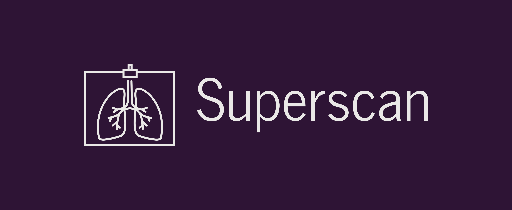
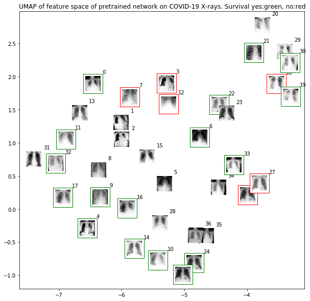

## Superscan
* Medical Imaging x Deep Learning
* Dakar Institute of Technology Winter 2020 - Final Project

## Target
Covid-19 Chest X-Ray

## Software
* Python 3.7
* Tensorflow 2.1.0

## Initial results



## Citation

```
Joseph Paul Cohen
COVID-19 image data collection
https://github.com/ieee8023/covid-chestxray-dataset, 2020
```

```
@article{cohen2020covid,
  title={COVID-19 image data collection},
  author={Joseph Paul Cohen},
  journal={https://github.com/ieee8023/covid-chestxray-dataset},
  year={2020}
}
```

© Copyright 2020 Fodé Diop - MIT License
